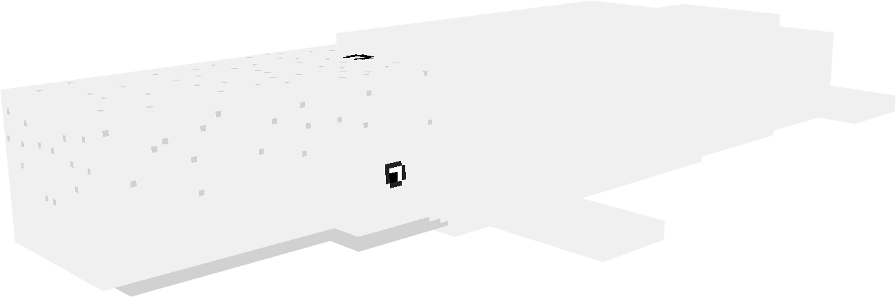
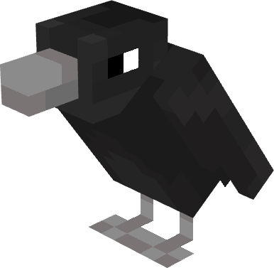
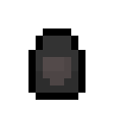

# English Mod

A Minecraft Fabric mod themed around classic English literature. Adds mobs, items, and interactions drawn from Edgar Allan Poe, Herman Melville, and more.

---

## Mobs

### Moby Dick

A massive sperm whale that roams ocean biomes. Neutral, leaves you alone unless provoked, then retaliates.

- **Health:** 80
- **Attack:** 6 damage
- **Behavior:** Swims freely in deep ocean. Fights back when attacked.
- **Spawn:** Ocean biomes (natural spawning)
- *Inspired by* Moby-Dick *by Herman Melville*

| Spawn Egg |
|---|
|  |

---

### Raven

*"Quoth the Raven, 'Nevermore.'"*

A raven that watches from the shadows. Name one "Poe" with a nametag and it will respond to every chat message with "Nevermore."

| Spawn Egg |
|---|
|  |

- *Inspired by* The Raven *by Edgar Allan Poe*

---

## Items

### Amontillado Wine

*"A pipe of what passes for Amontillado."*

Drinking it teleports you into a sealed brick chamber. No way out.

- Stacks to 16
- Always drinkable
- *Inspired by* The Cask of Amontillado *by Edgar Allan Poe*

---

### Black Veil

A wearable veil that renders over the player's face. Every mob within 12 blocks flees from the wearer, clearing their target, stopping their path, and running in the opposite direction. Even hostile mobs will not attack you while the veil is worn.

- Armor slot: helmet
- No armor value, purely cosmetic and behavioral
- Repairable with leather
- *Inspired by* The Minister's Black Veil *by Nathaniel Hawthorne*

---

## Compatibility

- **Minecraft:** 26.1.2 (Snapshot)
- **Loader:** Fabric
- **Fabric API:** Required
